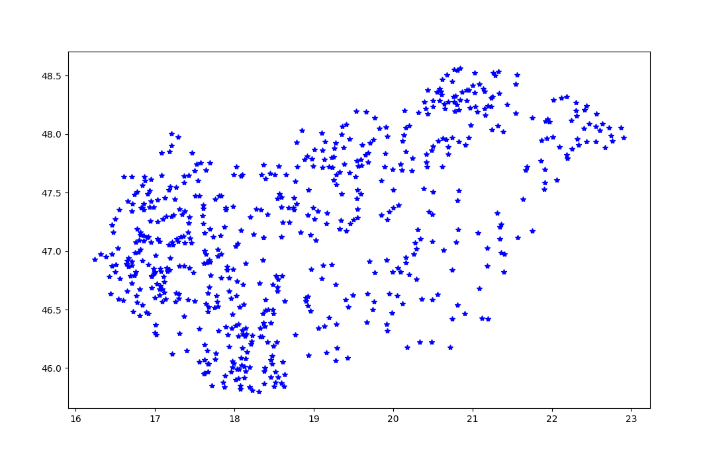
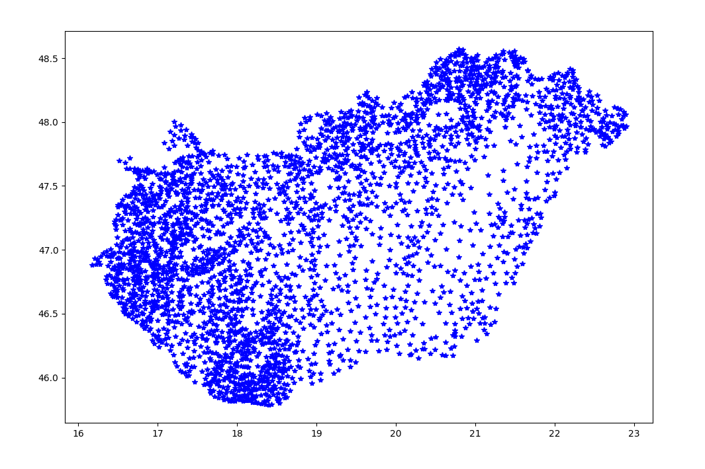
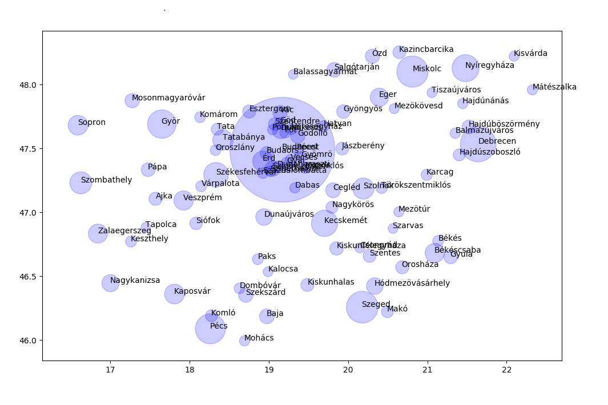

# 1. gyakorlat
Python bevezetés, Python 2 vs Python 3, IDE, egyszerű matematika, változók, szintaxis, és logika, ciklusok `I.`, string `I.`

## Feladat - Aritmetika
- Írjunk programot a fontosabb aritmetikai műveletetek szemléltetésére. 
- *Megoldás*: `01/simpleMath.py` - [link](01/simpleMath.py)

## Feladat - Bank
- Írjunk programot, amely a lenti mondatokat írja ki, ciklus segítségével. 

```
2018: 100.00 Ft van a bankban, 1.1-es kamattal
2019: 110.00 Ft van a bankban, 1.1-es kamattal
2020: 121.00 Ft van a bankban, 1.1-es kamattal
2021: 133.10 Ft van a bankban, 1.1-es kamattal
2022: 146.41 Ft van a bankban, 1.1-es kamattal
2023: 161.05 Ft van a bankban, 1.1-es kamattal
```
- *Megoldás*: `01/bank.py` - [link](01/bank.py)

# 2. gyakorlat
String `II.` (replace, find, count, lower, stb), feltételek (if, elif, else)

## Feladat - Fizzbuzz
- Fizzbuzz: Koncentrációs játék, ahol 1-től kezdve soroljuk a számokat, és minden 3-mal osztahtó szám helyett azt kell mondani, hogy Fizz, az 5-tel oszthatók helyett, hogy Buzz. Ha 3-mal és 5-tel is osztható a szám, akkor azt kell mondani, hogy FizzBuzz. 
- Írjunk programot, ami ilyen módon számol 1-től 100-ig! 
- *Megoldás*: `02/fizzbuzz.py` - [link](02/fizzbuzz.py)

## Feladat - String szeletelés
- Írjunk programot, ami a string szeletelését szemlélteti.
- Induljunk ki a *`"@shannonturner"`* majd valósítsuk meg a következő funkciókat:
 ```
 My github handle is  @shannonturner
 My first name is  shannon
 My last name is  turner
 My last name is  turner
 My twitter handle is NOT  @shannon
 My last name is  turner
 My first name is  shannon
 ```
- *Megoldás*: `02/slicing.py` - [link](02/slicing.py) (c) Shannon Turner 

## Feladat - Palindrom
- A palindrom szűkebb értelemben olyan szó vagy szókapcsolat, amely visszafelé olvasva is ugyanaz. Pl: `Géza, kék az ég`.
- Írjunk programot, amely ellenőrzi egy stringről, hogy palindrom-e. Ehhez az kell, hogy a programunk ne vegye figyelembe a kis/nagybetű közti különbséget  illetve a szóközöket. 
- *Megoldás*: `02/palindrom.py` - [link](02/palindrom.py)

## Feladat - Piramis
- Írjon programot, amely bekér a felhasználótól egy számot _(ezt külön validálni nem kell)_ és a számnak megfelelő sorú piramis alakzatot rajzol ki `A` betűkből, például:
``` python
Kérem a sorok számát: 12
            A              1
           A A             2
          A A A            3
         A A A A           4
        A A A A A          5
       A A A A A A         6
      A A A A A A A        7
     A A A A A A A A       8
    A A A A A A A A A      9
   A A A A A A A A A A     10
  A A A A A A A A A A A    11
 A A A A A A A A A A A A   12
```
- *Megoldás*: `02/piramis.py` - [link](02/piramis.py)

## Feladat - Szövegpiramis
- Írjon programot, amely a `Széchenyi István Egyetem, Győr` szöveget jelzi ki, soronként bővülő karakterszámmal:
```
S
Sz
Szé
Széc
Széch
Széche
Széchen
Szécheny
Széchenyi
Széchenyi 
Széchenyi I
Széchenyi Is
Széchenyi Ist
Széchenyi Istv
Széchenyi Istvá
Széchenyi István
Széchenyi István 
Széchenyi István E
Széchenyi István Eg
Széchenyi István Egy
Széchenyi István Egye
Széchenyi István Egyet
Széchenyi István Egyete
Széchenyi István Egyetem
Széchenyi István Egyetem,
Széchenyi István Egyetem, 
Széchenyi István Egyetem, G
Széchenyi István Egyetem, Gy
Széchenyi István Egyetem, Győ
Széchenyi István Egyetem, Győr
```
- *Megoldás*: `02/szechenyi.py` - [link](02/szechenyi.py)

# 3. gyakorlat
Ciklusok `II.`, listák, join és split (string listává illetve fordítva)

## Feladat - Listák 1
``` python
torpok = ['Tudor', 'Vidor', 'Szende', 'Szundi', 'Hapci', 'Kuka', 'Morgó']
weasleyk = ['Bill', 'Charlie', 'Percy', 'Fred', 'George', 'Ron', 'Ginny']
zsirafok = ["Abigél", "Benő", "Zsebi"]
```
A fentihez hasonlóan állítsd elő az alábbiakat:
``` python
"Percy"
​["Fred", "George"]
​["Bill", "Charlie", "Percy", "Fred"]
​"arlie"
"Gin"
```
- Írjon olyan kódot, ami megmondja, hogy Ron hányadik Weasley testvér
- Ron ábécé sorrendben hányadik Weasley testvér?
- A három legfiatalabb Weasley testvér közül ábécében ki az első?
- Írjon olyan kódot, ami lemásolja a weasleyk listát és a másolatból kitörli Percy-t.

## Feladat - Listák, stringek 2
- Írjon programot, ami beolvas egy szöveget, és megmondja, hány e betű van benne.
- Írjon programot, ami beolvas egy szöveget, majd egy betűt, és megmondja, a betű hányszor szerepel a szövegben.
- Írjon olyan programot, ami beolvas két szöveget és kiírja azt, amelyikben több az e betű
- Írjon olyan programot, ami beolvas egy mondatot, majd kiírja, hány szóból áll

## Feladat - Duplum törlés
- Írjunk olyan python kódot, amely kitöröli egy listából a duplumokat pl. `a = [10,20,30,20,10,50,60,40,80,50,40]`
- *Megoldás*: `03/duplum-torol.py` - [link](03/duplum-torol.py)

## Feladat - Kisebb, mint
- Írjunk python kódot, amely a beolvasott szamnál kisebb elemeket írja csak ki az adott listából pl. `a = [1, 1, 2, 3, 5, 8, 13, 21, 34, 55, 89]`
- *Megoldás*: `03/kisebb-mint.py` - [link](03/kisebb-mint.py)

## Feladat - Legnagyobb szám
- Írassuk ki a lista legnagyobb elemet pl. `list = [1, 3, 5, 2, 4, 8, 0]`
- *Megoldás*: `03/legnagyobb-szam.py` - [link](03/legnagyobb-szam.py)

## Feladat - Lista különbség
- Jelenítsük meg két lista közötti különbségeket `list1 = [1, 2, 3, 4, "Alma", "Korte", "Szilva", "Barack"]` `list2 = [1, 2, "Korte"]`
- *Megoldás*: `03/lista-kulonbseg.py` - [link](03/lista-kulonbseg.py)

## Feladat - Sztring szeletelés
- Vágjunk szét egy sztringet a vesszök mentén
- *Megoldás*: `03/split.py` - [link](03/split.py)

# 4.  gyakorlat
Fájlok, flagek (r, w, b, +), szöveges formátumok, csv, matplotlib `I.`
## Feladat - Magyarország helységei plot
- *Megoldás*: `04/moplot.py` - [link](04/moplot.py)
- Írjon programot, ami beolvassa Magyaroszág helységeit a `mohely.csv` fájlból, majd megjeleníti azokat
- Mivel több, mint 3000 darab település van, elég minden 5.-et kiplottolni, így gyorsabban megjeleníti
- A `fok:perc.századperc`-ből a `fok + (perc + (század / 60)) / 60` képlettel lehet decimális értéket számolni
- Például Győr északi szélessége `47:41.28`, ez decimálisan: `47.691`
- A `mohely.csv` tartalma nagyjából így néz ki:
	``` python
	Név;KeletiHossz;ÉszakiSzél
	Aba;18:31.49;47:02.06
	Abádszalók;20:35.94;47:28.48
	Abaliget;18:07.09;46:08.63
	...
	Zsujta;21:16.80;48:30.04
	Zsurk;22:13.40;48:23.93
	```
- Így nézzen ki a plot:




## Feladat - Magyarország helységei scatter
- Fejlessze tovább a programot, `scatter` plottal, ami a népesség arányában jelenít meg különböző méretű köröket 
- Az adatokat `monepesseg.csv`-ből olvassa be, ez csak a legnagyobb 88 települést tartalmazza
- A `monepesseg.csv` tartalma nagyjából így néz ki:
	``` python
	Budapest;1752704
	Debrecen;201981
	Szeged;161137
	Miskolc;157177
	Pécs;144675
	Györ;129301
	...
	Tapolca;15232
	Balassagyarmat;15058
	```
- Így nézzen ki a plot:

- *Megoldás*: `04/moscatter.py` - [link](04/moscatter.py)

# 5.  gyakorlat
Hasznos külső library-k: matplotlib `II.`, numpy

## Feladat - Monte-Carlo integrálás

Monte-Carlo integrálás felhasználásával közelítsük a PI értékét.

A sík [0;1]x[0;1] tartományán belül vegyünk fel egyenletes eloszlás mellett véletlenszerű pontokat. Nézzük meg, hogy a felvett koordináták közül melyek esnek az origó középpontú, 1 sugarú negyedkör belsejébe. A körcikkbe eső pontok és az összes felvett pont arányával súlyozott [0;1]x[0;1] síkrészlet területe a PI/4 értékét fogja közelíteni. A Közelítés annál pontosabb, minél több véletlenszerű pontot veszünk fel.

[Megoldás](05/1_a.py)

Vizsgáljuk meg az eredményt több különböző koordináta darabszám mellett. Pl 10, 100, 1000, 10000, 100000, és a különböző eredményeket ábrázoljuk pont diagramon.

Vizsgáljuk meg, hogy minden pont darabszám esetén több mérést végezve, hogyan alakul a mérések pontatlansága. Ábrázoljuk pont diagramon a méréseket.

[Megoldás](05/1_b.py)

## Feladat - Numerikus deriválás

Numerikus deriválási módszer segítségével nézzük meg, hogy egy diszkrét függvénynek hol vannak a lokális maximum és minimum pontjai.

Egy F függvény esetén az F(x) pontban a derivált értékét közelítsük az F'(x) = F(x-1) - F(x+1) értékkel. Ügyeljünk rá, hogy a függvény széleinél már nem lesznek minden irányban szomszédos értékek. A derivált függvényt és az eredeti függvényt jelenítsük meg pont diagram segítségével. Megfigyelhető, hogy a maximum és minimum helyek ott vannak, ahol a derivált metszi a vízszintes tengelyt.

[Megoldás](05/2.py)

# 6.  gyakorlat
Dict, kivételkezelés (try / except) 

Olvassuk be "kézzel" a [Pokemon.csv](06/Pokemon.csv) fájlt és a pokémonok adatait tároljuk el olyan listába, ahol kulcs-érték párokkal rögzítjük az értékeket.

Diagram segítségével hasonlítsuk össze a legendás és nem legendás pokémonok támadási és védekezési erejét.

Készítsünk tuple-t, mely tartalmazza azon pokémonok nevét, amelyek elsődleges típusa a víz és gyorsasági értéke legalább 100 és maximum 150. Jelenítsük meg a kiválasztott pokémonok neveit, szóközzel elválasztva.

Kulcs-érték párba rendezve tároljuk el a pokémonok neveit (érték) a pokémonok elsődleges típusa szerint (kulcs). Ábrázoljuk oszlopdiagram segítségével, hogy az egyes típusokba hány pokémon tartozik.

[Megoldás](06/pokemon.py)

# 7.  gyakorlat
Függvények, pár további hasznos library (import from ... import ... as szintaktika, time, random, math, regex (regular expressions), os, sys, json)

# 8.  gyakorlat
Python: osztályok, objektum orientált programozás

## Feladat - 2d pontok
- A Python objektum orientált programozást a 2D-s pontok osztályának elkészítésén keresztül mutatjuk be. A Python nyelvben minden osztály (például a lista vagy a szótár is, de a függvények is). Egy `point2d.py` nevű fájlban kezdjük el az osztály kódjának elkészítését.
- *Megoldás*: `08/point2d.py` - [link](08/point2d.py) (c) Siki Zoltán

# 9.  gyakorlat
Raspberry Pi: Python GPIO

# 10.  gyakorlat
OpenCV és képfeldolgozás `I.`

## _Used sources_ / Felhasznált források
- [Shannon Turner: Python lessons repository](https://github.com/shannonturner/python-lessons) MIT license (c) Shannon Turner 2013-2014
- [Siki Zoltán: Python mogyoróhéjban](http://www.agt.bme.hu/gis/python/python_oktato.pdf) GNU FDL license (c) Siki Zoltán
- [BME AUT](https://github.com/bmeaut) MIT License Copyright (c) BME AUT 2016-2018
